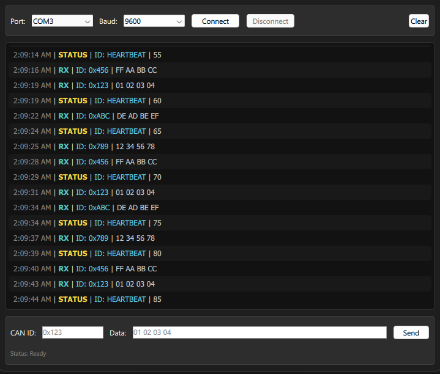

# CAN Visualizer

A real-time CAN bus visualizer and message sender built using Qt and QML.
This desktop tool communicates with an ESP32 microcontroller over UART, allowing you to monitor incoming CAN messages and send outgoing ones in a structured, human-readable UI.

## 🔧 Features

- 📡 **Serial Communication** — UART-based connection to ESP32
- 📋 **CAN Message Log** — Color-coded RX/TX messages with timestamps
- 🎛️ **Interactive Controls** — Choose serial port, baud rate, and send custom CAN messages
- 🧼 **Clear UI** — Minimalist theme with syntax highlighting and scrollable logs

## 📷 Screenshots
<p align="center">
  
</p>
## 💡 Why This Exists

Built as a side project to:
- Learn and apply **Qt/QML** UI development
- Test and simulate **embedded UART communication**
- Serve as a lightweight **debugging interface** during firmware development

## 🧠 Tech Stack
- **Qt 5.15+ / Qt 6**
- **QML** for frontend layout and styling
- **C++** for backend logic and serial port handling
- **ESP32** as the CAN message simulator

## 🚀 Getting Started

### Requirements
- Qt (with Qt Creator)
- ESP32 flashed with the [firmware](./firmware)

### Run
```bash
# Open the project in Qt Creator
# or build and run manually:
qmake && make && ./CAN_Visualizer
```

## 🧪 Firmware Format (ESP32)
The ESP32 is expected to send messages over UART using this format:

```
RX|0x123|01 02 03 04|OK
TX|0x456|DE AD BE EF|SENT_OK
STATUS|HEARTBEAT|255
```

The visualizer parses these messages to display them appropriately.

## ✍️ Author
**Tanvir Leon** — [@tanvirleon](https://github.com/tanvirleon)

## 📄 License
MIT — see `LICENSE` file.
# CAN Visualizer

A real-time CAN bus visualizer and message sender built using Qt and QML.
This desktop tool communicates with an ESP32 microcontroller over UART, allowing you to monitor incoming CAN messages and send outgoing ones in a structured, human-readable UI.

## 🔧 Features

- 📡 **Serial Communication** — UART-based connection to ESP32
- 📋 **CAN Message Log** — Color-coded RX/TX messages with timestamps
- 🎛️ **Interactive Controls** — Choose serial port, baud rate, and send custom CAN messages
- 🧼 **Clear UI** — Minimalist theme with syntax highlighting and scrollable logs

## 📷 Screenshots
Coming soon!

## 💡 Why This Exists

Built as a side project to:
- Learn and apply **Qt/QML** UI development
- Test and simulate **embedded UART communication**
- Serve as a lightweight **debugging interface** during firmware development

## 🧠 Tech Stack
- **Qt 6.9.1 / Qt 6**
- **QML** for frontend layout and styling
- **C++** for backend logic and serial port handling
- **ESP32** as the CAN message simulator

## 🚀 Getting Started

### Requirements
- Qt (with Qt Creator)
- ESP32 flashed with the [firmware](./firmware)

### Run
```bash
# Open the project in Qt Creator
# or build and run manually:
qmake && make && ./CAN_Visualizer
```

## 🧪 Firmware Format (ESP32)
The ESP32 is expected to send messages over UART using this format:

```
RX|0x123|01 02 03 04|OK
TX|0x456|DE AD BE EF|SENT_OK
STATUS|HEARTBEAT|255
```

The visualizer parses these messages to display them appropriately.

## ✍️ Author
**Tanvir Leon** — [@tanvirleon](https://github.com/tanvirleon)

## 📄 License
MIT — see `LICENSE` file.
